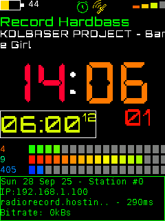

# Thanks to:
- https://oleddisplay.squix.ch/ <- font generation
- https://javl.github.io/image2cpp/
- https://www.svgrepo.com/svg/521874/telegram
- Volos Projects for inspiration

I'll help if you need it. Basically in TFT eSPI library set the config for your screen.

In hardware_definitions.h set you i2s pins.

WiFi configuration and Telegram token setting is done via serial on boot.

STL files are included for the case.

The license is BSD 2 Clause. Have fun.

Looks like this:

# Features:
1. Preferences.h configuration of almost all functions
2. Stores 5 WiFi APs and tries each on boot
3. Stores 8 Radio Stations
4. Can play any radio station URL
5. Can be configured via Serial or via telegram
6. Alarm configured via serial/telgram includes volume
7. Power limiting available to reduce battery consumption
8. Has horizontal graphs for volume, buffer and power use
9. Records ping ms for current station
10. Clock and alarm clock use rainbow coloring for HH, MM and SS
11. Timezone programmable
12. Keeps time up to date automagically
13. Has battery and wifi signal icons
14. Lots of other stuff I forgot

# Bugs:
For some reason it plays fine when I proxy high bitrate music streams through my personal server, but struggles when directly streaming.
Some other random memory leaks.
This device isnt super powerful so graphic updates are gradual. Like individual letters, numbers etc are deleted and redrawn. 

# Design:
Uses a "fat struct" called g_machine for almost everything it runs. I've put the functions into seperate libraries. The crazy thing is how good the sound quality is....
As for the hardware I basically just threw parts together.

# Parts list:
- TTGO T4 v1.1 (old stock I had)
- 2PCS 2" 4Ohm 3W DIY Small Full Range Audio Speaker
- TPA3110 XH-A232 30W+30W 2.0 Channel Digital Stereo Audio Power Amplifier Board DC 8-26V 3A
- MCU-219 INA219 I2C port Zero drift bidirectional current power supply monitoring sensor module
- TPS61088 5V 9V 12V Adjustable Boost Step Up Board Module Switch Power Supply Module 
- 3.7V 2500mAh battery (salvaged from somewhere)
- Interface I2S PCM5102A DAC Decoder GY-PCM5102 I2S Player

